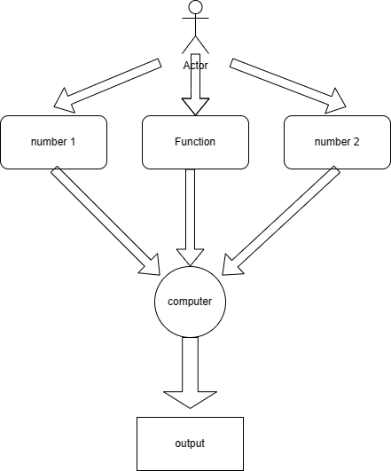

# Calculator as HM

## Description
the function is able to calculate easy math calculations as summing multiplying and others

## Instalation/Setup

	- Environment -> Python 3.12 
  - Module -> loguru, math

## Run and Use
first human is inserting the number1 function and number2.
+ "+" is for summ
+ "-" is for minus
+ ** for multiply
+ / for divide 
+ sqrt for square root ATENTTIONE 2nd number in square root if u want to ger sqrt only from first number 2nd has to be 1 or u can get sqrt from the multiply function for exmp 1st= 9 2nd=4 answer will be 6
```bash
python3 -m calc_main.py
```

## Testing

How to run tests


## Architecture concept

